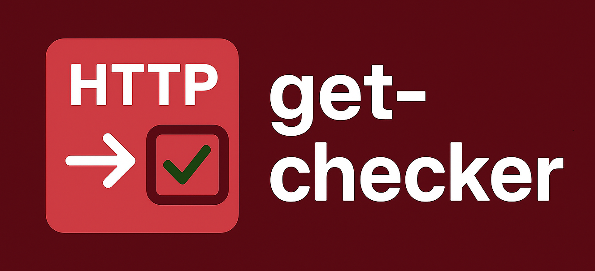

<div align="center">
  <picture>
    
  </picture>
</div>

<div align="center">
  <h1>Get-Checker (Terminal)</h1>
</div>

A simple **Python project** to monitor whether a website is online or offline. It periodically sends **HTTP requests** to the target website and logs the results. All the program will run in terminal chat.

---

## Features

-  Check if a website is online (HTTP 200 OK).
-  Detect connection errors and timeouts.
-  Continuous monitoring with a configurable interval.
-  Logging to both console and file (`monitor.log`).
-  Unit tests with `pytest`.

---

## Project Structure

    get_checker/
    │
    ├── get_checker/          # source code
    │   ├── __init__.py
    │   ├── checker.py        # website checking logic
    │   └── logger.py         # logging setup
    │   
    ├── tests/                # pytest tests
    │   └── test_checker.py
    │
    ├── .gitignore
    ├── requirements.txt      # dependencies
    ├── CHANGELOG.md
    ├── CONTRIBUTING.md
    ├── README.md             # project documentation
    └── main.py               # main entry point

---

## How to Install and Run the App.

#### 1.  Clone the repository:

``` bash
git clone https://github.com/yourusername/get-checker.git
cd get-checker
```

#### 2.  Create and activate a virtual environment:

``` bash
python -m venv venv
source venv/bin/activate   # on Linux/Mac
venv\Scripts\activate    # on Windows
```

#### 3.  Install dependencies:

``` bash
pip install -r requirements.txt
```

#### 4. Run the application:

``` bash
python main.py
```

#### 5. (Optitional) Check the Log

Open the `get_checker.log` to see all logs.


--- 

## Requirements

- **Python 3.x** (recommended: 3.11 or 3.12)
- **Requests** (To sends **HTTP requests**)
- **pytest** (for running tests).

---

## How to Run Tests

**1. Install pytest** (installing requirements or this step):
```bash
pip install pytest
```

**2. Run the tests**:
```bash
pytest
```

Pytest will automatically discover tests inside the `tests/` directory and run them.

---

## Notes


---

## License

This project is licensed under the MIT License.  
See the [LICENSE](LICENSE) file for details.

---

## Author

**Lucas Alcântara**  
GitHub: [@A1cantar4](https://github.com/A1cantar4)